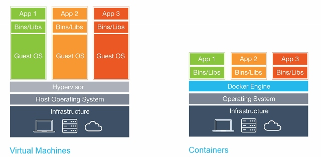

# Containers for embedded systems

In this series of posts we'll explore **why and how** to use containers in embedded systems, a combination that is still not common. Along the series we’ll use a **Jetson Nano** development kit to do small demonstrations (but you can easily reproduce them in other devices like a raspberry pi), and all code and steps to reproduce them are in [this git repository](https://github.com/LeonardoSanBenitez/containers-for-embedded-systems).

**Our goal** with this series is twofold:

* For you that still don't use containers, to give you a head start in conceptual understanding and code to be reused in your work;
* For you that already use containers, to discuss best practices and tools to ease your work.

In this first post, we'll see the fundamentals of containers and present our "hello world" demo that we'll use throughout the series. Fasten your belt, grab a coffee, and let’s start!

## What are embedded systems

They are dedicated processing systems within a larger mechanical or electrical system, usually an enclosed product sold as a whole. Some examples are ABS controller, smart fridge interface, aviation autopilot: you won’t buy those things separately, they are embedded in larger products.

Embedded systems usually have strong requirements of performance, reliability, and production costs, posing unique challenges to developers and engineers. When these computing enabled devices are connected to the Internet we usually use the term Internet of Things, which also sounds much nicer ;)

## What are containers

They are a method for packaging, distributing, and running applications. Their main characteristic is that they can **isolate processes** from the operating system: dedicated memory, networking, namespaces, etc.

Sounds like a Virtual Machine, right? Yes, but one big difference is that containers share the operating system kernel of their host system, therefore they are lightweight. A direct consequence of that sharing is that containers can’t run a different OS (like running a Linux container on top of a Windows host), and can at most run different distributions of the same OS (like running a CentOS container on top of an Ubuntu host).



> Difference between Virtual Machines and Containers (Source: Docker)

Some important concepts: a *container* is a running instance of this isolated environment, being managed by a *container engine*. A container is started having as a base an *image*, a binary file with everything bundled together. An image can be *built* from a *definition file*, a text description of what goes inside the container.

But "container" is just an abstract concept, and there are many softwares that implements it. The most well-known container engine is called **docker**, and from now on I'll use both terms as synonyms.

## Why use containers

There are many advantages in using containers for any application, but I want to highlight things that are especially relevant in the context of embedded systems:

* **Simplify software development**: different developers can work in the same system with less interference between them. Each container can have different dependencies installed, have different toolchains, be built independently, etc.
* **Simplify testing**: each container is an isolated system, so you spend less time worrying about the configurations of your test setup. For the same reason, you can easily test the system in several different underlying configurations, something that in a non-container environment would probably require using several different devices.
* **Ease remote (over-the-air) updates**: you can store all container images in a central repository and update the application (or just part of the application) simply by stopping and starting a new container instance.
* **Quicker device setup**: setting up a fresh device requires only installing docker. Even when the OS is patched, updated, or maybe completely replaced, the setup procedure will likely remain unchanged.


As nothing is perfect, you need to be aware of some disadvantages:
* **Increase in resource usage**: containers do have an overhead compared with using just the OS. If your device is already at the limit of its performance, you may have to reconsider using containers.
* **Container-capable device**: containers require a device capable of running containers (dããã), which basically means a device with Linux. This may sound trivial to some software developers, but many embedded devices use only an RTOS (real-time operating system) or no OS at all.
* **Complexity and learning curve**: you probably already have a well-defined tooling to build your system, like Yocto, and to start using containers will add one more layer of complexity to this workflow. Also, you may need to manage several containers running on the same device, configure the workflows for building the container images, and so on.

## Our little demo

Guess what? IT’S A BLINK LED!


Okay, almost. We'll demonstrate the isolation feature of containers by breaking the traditional "blink led" example into **two independent modules**: one will read a button every one second and the button’s state (pressed or not) to the second module, which will turn on the led if the button is pressed.

The communication happens over HTTP: the first module initiates the request and the second is a web server waiting for requests. The modules are completely independent, could easily be developed by different persons, be written in different programming languages, and even have their proprietary source code hidden from each other.


> Demo with a button and led from Sparkfun, running on a jetson nano (inside the case).

Each image is described by a definition file named Dockerfile, that looks like this:

```
FROM arm64v8/python:3.7-slim-buster

WORKDIR /src

COPY requirements.txt ./
RUN pip install -r requirements.txt

COPY . .

CMD [ "python3", "-u", "./main.py" ]
```

That is, take a base image that already has python 3.7 installed (`FROM...`), then install the python dependencies for this project (`pip install...`), copy the source code to inside the containers (`COPY...`), and finally start our code (`python3...`). The code itself is even simpler:

```python
# Button module
import qwiic_button
import requests
import time

my_button = qwiic_button.QwiicButton()
while True:
    requests.post(f'http://led/{my_button.is_button_pressed()}')
    time.sleep(1)
```

```python
# Led module
import qwiic_button
import fastapi
import uvicorn

app = fastapi.FastAPI()

@app.post("/{state}")
async def root(state: bool) -> None:
    if state==True:
        app.state.my_button.LED_on(255)
    else:
        app.state.my_button.LED_off()
    
@app.on_event('startup')
async def server_startup():
    app.state.my_button = qwiic_button.QwiicButton()

if __name__ == "__main__":
    uvicorn.run('main:app', host="0.0.0.0", port=80, reload=True, debug=True)
```

The first sends one HTTP request per second (`requests.post...`) and the second is a FastAPI webserver that is first initiated (`uvicorn.run...`) and then listens to HTTP POST requests (`@app.post("/{state}")...`) to turn the led on or off (`my_button.LED_on...`).

I’m using an extension of docker called *docker-compose* to handle the two containers together, to *orchestrate* them. Once you have docker and docker-compose installed **in the device** (following [this instruction](https://github.com/LeonardoSanBenitez/containers-for-embedded-systems/blob/main/init_os.sh)), you can execute the command `docker-compose up` in the folder “tutorial-containers-01” to build and start running both containers.

Congratulations, you now have two containers working together in your embedded device :) 


## Conclusion and next steps

We have seen the basics of containers and how this technology can be useful to embedded systems, but there is still a lot to be explored. In the next post we will see how the usage of an **IoT platform**, specifically Azure IoT Hub, to manage embedded systems built with containers.
Stay tuned ;) 

## References

Embedded System Design. Peter Marwedel, Springer, 2018.

Docker documentation. Available at: https://docs.docker.com/get-started/resources/

Why the future of embedded software lies in containers. Till Adam, Embedded, 2021. Available at: https://www.embedded.com/why-the-future-of-embedded-software-lies-in-containers/

Containers on Linux embedded systems. Sandra Tobajas, Savoirfairelinux, 2020. Available at: https://blog.savoirfairelinux.com/en-ca/2020/containers-on-linux-embedded-systems/

Using containers on embedded Linux. Sergio Prado, Embeddedbits, 2021. Available at: https://embeddedbits.org/using-containers-on-embedded-linux/

How Linux Containers can Help to Manage Development Environments for IoT and Embedded Systems. Yan Vugenfirer & Dmitry Fleytman, The Linux Foundation. Available at: https://www.youtube.com/watch?v=F61MM_uuI5A 
