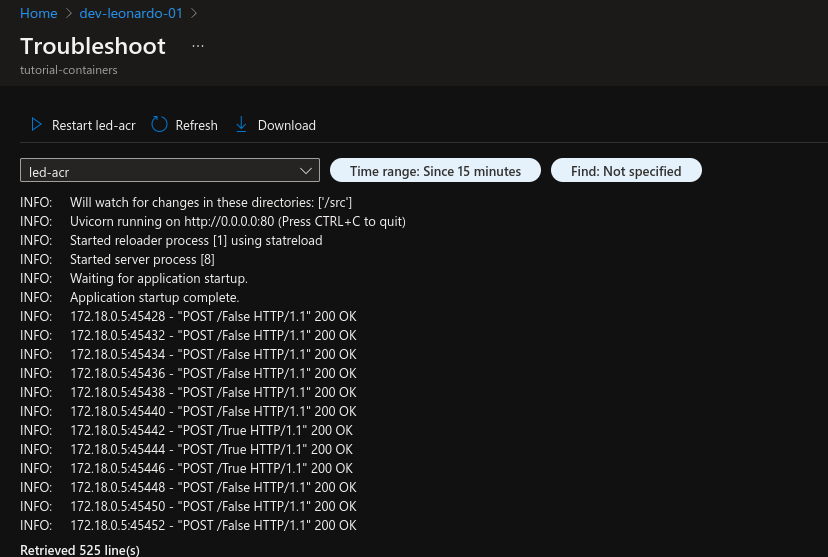
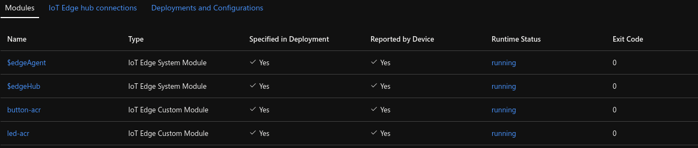

# 	Managing containers with an IoT Platform

This post is the second of a series about using containers for embedded systems, where in the [first post]() we have explored the fundamentals of containers. Now we’ll focus on using an IoT Platform (specifically, **Azure IoT Hub**) to ease the management of large embedded applications.

We’ll keep using our little practical demo with a Jetson Nano (but you can reproduce the tutorial in any Linux device) and we’ll demonstrate some of the platform capabilities using azure’s web UI (called Azure Portal). All code and steps to reproduce them are in [this git repository](https://github.com/LeonardoSanBenitez/containers-for-embedded-systems). And before we start, a huge thanks to the co-authors [Dan Danciu](https://www.linkedin.com/in/dan-danciu/) and [Ane Berasategi](https://www.linkedin.com/in/anebz/) :)

## What is an IoT Platform

It’s a system that “provides abstraction across the multitude of diverse devices and data sources in addition to allowing for the management and control of a range of systems and processes” (Rayes, 2019). That is, **ease development and management of IoT project**, even if we need to handle thousands of devices around the world with each of them running several applications/microservices.

In this tutorial we’ll use Azure IoT Hub mainly to centrally control which containers should be running in each device, debug the application remotely, and easily add/remove devices for our fleet. However, most IoT platforms (like IoT Greengrass or IBM Watson IoT) also will provide at least some of the following features :

| Device management                    | Application management         | Application development     | Application services            |
| ------------------------------------ | ------------------------------ | --------------------------- | ------------------------------- |
| Fault management and troubleshooting | Software/firmware installation | Data management             | Business rule support           |
| Configuring and deploying            | Patching                       | Temporary caching           | Event processing                |
| Accounting and billing               | Starting/stopping              | Permanent storage           | Data analytics                  |
| Performance monitoring               | Debugging                      | Data normalization          | Subscriptions and notifications |
| Security management                  | Monitoring                     | Policy-based access control | Service discovery               |

> Examples of key IoT Services Platform functions (Source: Rayes, 2019)

## IoT Hub setup

Before you start with IoT Hub you’ll need an [azure account](https://azure.microsoft.com/en-us/free/). Please note that the following setup may incur charges to your account, so take a look at the [Azure IoT Hub pricing](https://azure.microsoft.com/en-us/pricing/details/iot-hub/).

Now access the Azure Portal and create an IoT hub:

1. Search for IoT Hub
2. Hit Create
3. In “Resource group”, create a new one
4. Give a descriptive name to your IoT Hub (mine was tutorial-containers)
5. If you don’t need to change anything else (like the tier, in the management section, that will affect the pricing), just click on Review + Create

It may take some time to create, but you can proceed with the tutorial while that.


## Container build

Our containers won't build themselves when deploying, we need to **build them beforehand** and store their images somewhere. I'll store them in Azure Container Registry, but it could also be Docker Registry, AWS ECR, etc. To create one, access the Azure Portal and:

1. Search for Container registries
2. Hit Create
3. Select the same resource group as before
4. Give it a name (mine was tutorialcontainers), then click in Review + Create.

You’ll need to take note of some values to use them later: Login server (in the Overview section), usarname and password (in the Access keys section).

As we are using ARM32 images, **the easier way to build those images is in an ARM32 device**, so ssh into your jetson and build the containers there. Note the only change in the code was the container name from "led" to "led-acr" to avoid conflicts if you have done the first part of this tutorial. Now just substitute the values that you took note before in [this script](https://github.com/LeonardoSanBenitez/containers-for-embedded-systems/blob/main/tutorial-containers-02/build_push.sh) and execute it. It will log in to the registry, build, tag, and push both docker images.

In case you are wondering, we use the IMAGE_VERSION variable (in the script) because the edge device will pull new images from the registry only when there is in the registry an image with a higher version than the device have locally. Therefore, if you want to build different versions of your images, you need to change the version to indicate which should be downloaded by the edge device.

## Device enrollment

The IoT devices have to be **onboarded to IoT Hub** to be managed by the platform. Once this is done, all management can be done from the cloud. There are several ways to perform this onboarding, we’ll use the easier. This section is a summary of [this Microsoft documentation](https://docs.microsoft.com/en-us/azure/iot-edge/how-to-register-device?view=iotedge-2020-11&tabs=azure-portal), and there you’ll also find more information about the other deployment methods.


Now go to the Azure Portal and:
1. Select the created IoT Hub
1. Go to IoT Edge, then Add Iot Edge Device
2. Choose a descriptive name (I chose dev-leonardo-01)
3. Authentication type: Symmetric key
4. Auto generate keys: yes
5. Connect this device to an IoT hub: enable
6. Save


Go back to "IoT Edge", select your device and take note of the primary connection string. After the cloud-side setup, we need to perform the device-side setup. Substitute the connection string in [this script](https://github.com/LeonardoSanBenitez/containers-for-embedded-systems/blob/main/tutorial-containers-02/device_configuration.sh) and execute it. It basically installs IoT Edge on the device and configures it so it can connect with IoT Hub on the cloud

You may have to wait a few minutes for everything to be configured, but soon you'll see on the portal your device with the status "417 -- The device's deployment configuration is not set". Don’t worry, the error message will disappear after the next LAST step, go go!

## Module deployment

Your device is now ready to be **controlled from the cloud**, so let’s do something!

The configuration is done using JSON descriptions of the containers that should be running on the device: what images, volumes, port mapping, etc. I won’t enter in details about those configurations, maybe in a future tutorial, but you can find more in [microsoft’s](https://docs.microsoft.com/en-us/azure/iot-edge/how-to-use-create-options?view=iotedge-2020-11) and [docker’s](https://docs.docker.com/engine/api/v1.32/#operation/ContainerCreate) documentation.

Now go to your IoT Hub in the Portal and:

1. Enter in IoT Edge
2. Select your device
3. Click Set Modules, Add, IoT Edge module
4. Add our “button” module
   1. Name: "button-acr"
   2. Image URI: "tutorialcontainers.azurecr.io/button-acr:1.0"
   3. Container Create Options:

```
{
    "HostConfig": {
        "Privileged": true,
        "Devices": [{
            "PathOnHost": "/dev/i2c-1",
            "PathInContainer": "/dev/i2c-1",
            "CgroupPermissions": "mrw"
        }]
    }
}
```

5. Add our “led” module
   1. Name: "led-acr"
   2. Image URI "tutorialcontainers.azurecr.io/led-acr:1.0"
   3. Container Create Options:

```
{
    "HostConfig": {
        "Privileged": true,
        "PortBindings": {
        	"80/tcp": [{
                "HostPort": "80"
            }]
        },
        "Devices": [{
        	"PathOnHost": "/dev/i2c-1",
        	"PathInContainer": "/dev/i2c-1",
        	"CgroupPermissions": "mrw"
        }]
    }
}
```
6. Review and create, Create

And your device is enrolled!


## Advantages of an IoT Platform

May take a few minutes to download and run the images. Just grab a coffee and wait, soon you’ll have all containers running just as we had in the **first tutorial**! But... what is the difference?

* **Remote log centralization**: the execution logs of your application, which are precious to debugging and monitoring, are now immediately available on the Portal (just select your device and click in “Troubleshoot”), something that usually would require accessing each device directly.
* **Configuring the containers remotely**: in the last section you set the modules just by writing some parameters in the Portal, and the edge device received those instructions and made the required changes to itself. As your application will probably be updated, patched, and refactored several times, that functionality can be extremely useful.
* **Device management**: now you can easily disable devices, rotate cryptographic keys, check the device state in real-time, among several other management features. Those management tasks may sound trivial if you have one device, but will consume a huge amount of time if you have a fleet of devices in production.





All those features came “for free”, we didn’t did any changes to the code. However, Azure IoT solutions offer many many more features, **including ones that could greatly ease our coding**: communication between modules and between devices, message routing, plug-and-play access to third-party modules, etc. 

## Conclusion

There are many advantages in using an IoT Platform, but it can also be complicated and - even if you learn it well - have several steps/processes to get everything right. **This complexity is common in modern IT infrastructures**, but we can ease our own work in many ways: provision infrastructure resources from code, write pipelines for repetitive tasks (like building containers), use the azure command-line interface instead of the Portal, among several others.

In the next tutorial we’ll see how modern **DevOps tools and practices** can be applied to embedded systems projects, helping to have workflows that are automated, less error-prone, and highly reproducible. 

Stay tuned!

## References

Internet of Things: From Hype to Reality. Ammar Rayes and Samer Salam. Springer, 2016.

IoT Platforms: What They Are & How To Select One. Brian Ray. Link-labs, 2016. Available at: https://www.link-labs.com/blog/what-is-an-iot-platform

Embedded System Design. Peter Marwedel, Springer, 2018.
