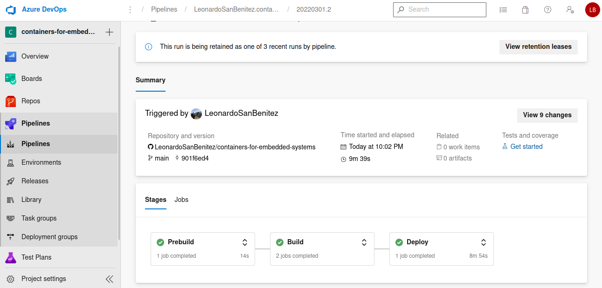

# Streamline IoT projects with Infrastructure as Code

This post is the second of a series about using containers for embedded systems, where in the [first post]() we have explored the fundamentals of containers and in the [second post]() we have seen how to use an IoT Platform to ease the containers management. Now we’ll focus on how modern **DevOps tools and practices** can be applied to this type of project, helping to have workflows that are automated, less error-prone, and highly reproducible. 

We’ll still use our little demo with Jetson Nano as an example, but this time there is zero news in the example itself: we’ll just explore the processes that surround the application. Before we dive into the tutorial, a huge thanks to the co-authors [Dan Danciu](https://www.linkedin.com/in/dan-danciu/) and [Ane Berasategi](https://www.linkedin.com/in/anebz/) :)

# What is infra as code

Are practices and tools to automate infrastructure/operations tasks with declarative code, just as if they were software and data. That is, to turn manual procedures into executable code.

Many things can be put under this umbrella:

* **Infrastructure provisioning:** create the resources on the cloud provider.
* **Resource setup:** prepare the created resources to receive the application (like installing docker).
* **Packaging Server Templates:** generate preconfigured images with all that the server will need.
* **Pipeline setup:** describe and execute automated workflows for common tasks (like code test, deployment, etc).

# Infrastructure provisioning

Our first task will be to create the IoT Hub and the Container Registry using a tool called **Terraform**. Terraform allow us to describe the infrastructure elements that we want, and then it will take care of provisioning those elements for us.

On your development machine (your normal computer), you’ll have to install azure CLI and Terraform. The Jetson Nano doesn’t require any additional installation.

The “database” where Terraform will store information about what is being created is a file called **state file**. It can be stored on your local computer, but it’s a better practice to save it on the cloud. I choose azure blob storage (could be AWS S3, Google Cloud Storage, among others), and the storage account to store it have to be created without Terraform, and in this case we’ll do it with Azure CLI. To do that, open a terminal, authenticate yourself with the Azure CLI (run `az login` and follow the instruction), and execute the script storage_create with `bash storage_create.sh`. As you can see, that script will create the storage account and storage container that we need to store our Terraform state file:

```bash
#!/bin/bash
# You must be authenticated with az cli

# Variables
RESOURCE_GROUP_NAME=tutorial-terraform-backend
STORAGE_ACCOUNT_NAME=tutorialtfstate
CONTAINER_NAME=tfstate
LOCATION=EastUS

# Create resources
az group create --name $RESOURCE_GROUP_NAME --location $LOCATION
az storage account create --resource-group $RESOURCE_GROUP_NAME --name $STORAGE_ACCOUNT_NAME --sku Standard_LRS --encryption-services blob
az storage container create --name $CONTAINER_NAME --account-name $STORAGE_ACCOUNT_NAME 
```

Now we are ready to run Terraform itself. Go to the folder `tutorial-containers-03/terraform`, modify the file `variables.tf` to have the `subscription_id` and `tenant_id` of your azure environment (you can find those in the Azure Portal searching for Subscriptions and then for Azure Active Directory). Run `terraform init` to tell Terraform to install all stuff it will need.

To create the resources, just run `terraform apply`. Terraform will prompt you to confirm the resources that you want to create, just go ahead and type “yes”. As you can see in the file `main.tf`, there are several “blocks” that describe each desired element, like this one for the IoT Hub:

```
resource "azurerm_iothub" "main" {
  name                = var.name_simple
  resource_group_name = azurerm_resource_group.main.name
  location            = azurerm_resource_group.main.location

  sku {
    name     = "S1"
    capacity = "1"
  }
}
```

If everything was successful, then you will already be able to see all newly created resources at the Azure Portal


# Deployment template

Do you remember when we manually select which modules should be deployed to Jetson, their configurations, etc? We can do the same now just writing a text file. 

The “deployment template” of IoT Hub is a **complete description** of what modules should be deployed, in a similar way as docker-compose that we used in the first tutorial. This template can have many parameters that microsoft will use when generating the actual deployment file (that is also just another text file with json syntax), and then the configuration will be applied to the devices. 

I won’t enter in detail about its syntax, please go ahead and explore it yourself. The only thing that you’ll have to change there is the field `registryCredentials`, with the same credentials that you used in the last tutorial.

# CI/CD pipeline

There are two essential tasks for this tutorial: build the container and apply the deployment template. To automate those tasks we'll use Azure Pipelines, which is part of the set of solutions called Azure DevOps.

Go to https://dev.azure.com and create a new organization (or use an existing one). Then create a new project inside that organization, and finally create a new pipeline inside that project doing the following:

1. Go to the section Pipelines
1. Click New pipeline
1. Where is your code: Github
1. Select the repository
1. You'll be redirected to Github to approve the connection
1. Configure the pipeline with the option “Existing Azure Pipelines YAML file”, selecting `tutorial-containers-03/azure-pipelines.yml`.
1. Review and create the pipeline.

Now **every time you push your code to Github the pipeline will be triggered** and will execute the steps described in that yaml file, and you’ll see a “report” looking like this:



In the following sections I’ll explain a little of the syntax of that file, as well as some configurations that still have to be done in order to run the pipeline successfully.

## Pre-build

Before building the container images, we need to **decide whether the containers should be built or not**, so that we don't build every container every time, and we’ll use the module version for that.

Up to now we informally labeled the images as “1.0”, “1.1”, etc, and now we’ll use a separate file called `module.json` for that. This format is an informal standard of Azure IoT, but as we have seen in the previous tutorial, you don't need to follow it. When you make changes in the code that you want to see reflected in the running containers, go to that file (inside the folder of each module) and modify its version.

But the pipeline has to "remember" if it has already built an image before, right? We'll use Pipeline Library to that:

1. Go to the section Pipelines
2. Library
3. Create variable group
4. Give it the name "Latest Image Versions"
5. Add two variables, "button_latest" and "led_latest", both with the value 1.0.0
6. Pipeline permissions
7. Select our pipeline
8. Give permissions to the pipeline to write the variables
    a. security
    b. give Administrator permission to the user "<project name> Build Service"

You don’t need to modify anything on the script itself, and you can see that it just reads the `module.json` file, compare the field version with the version in the library, and then store it in the variable `doBuild`:

```
  - task: PowerShell@2
    displayName: "should ${{ parameters.module }} be built"
    name: ${{ parameters.module }}
    inputs:
      targetType: "inline"
      script: |
        $package = Get-Content "${{ parameters.modulesPath }}/${{ parameters.module }}/module.json" | out-string | ConvertFrom-Json
        $version = $($package.image.tag.version)
        $latest = "${{ parameters.latestVersion }}"
        $doBuild = $($version -ne $latest)
        Write-Host "##vso[task.setvariable variable=doBuild;isOutput=true]$doBuild"
        if($doBuild) {
          Write-Output "${{ parameters.module }} will be built with new version $($version)"
        }
        else {
          Write-Output "Module version not changed - will not build"
        }

```


## Build

Now, **build the container images and push them to the container registry**. This is just the execution of a script, as we have done in the last tutorial, but first you have to give permissions to Azure Pipelines to push containers to your registry, by setting up a service connection:

1. Project settings
1. Service connections
1. New Service Connection
1. Select Docker Registry
1. Select Azure Container Registry
1. Select the subscription in which you created the registry, and then the registry itself
1. Give it the name "acr connection"
1. Enable the option "grant access permission to all pipelines"

For this tutorial this was not required, but we decided to also **build the images for several architectures**. Since we are just using a Jetson Nano, the only image that will really run is the arm64 one. If you are using a raspberry pi you can use the arm32 one, or even use the amd64 to test/debug the containers in your personal computer.

You can see that the build step is quite big, but most of it is just the “boilerplate” required to execute the main build-and-push step:

```
  - task: Powershell@2
    name: buildarm64
    displayName: "arm64v8: Build ${{ parameters.moduleName }}"
    inputs:
      targetType: "inline"
      script: |
        docker buildx build --platform linux/arm64 `
          -f "$(System.DefaultWorkingDirectory)/${{ parameters.modulesPath }}/${{ parameters.moduleName }}/Dockerfile.arm64v8" `
          -t "${{ parameters.registryAddress }}/${{ parameters.moduleName }}:$(version)-arm64v8" `
          --push `
          "$(System.DefaultWorkingDirectory)/${{ parameters.modulesPath }}/${{ parameters.moduleName }}"
```

If you run the pipeline now (by committing and pushing to Github), you'll see that all containers are built. If you access the container registry, you'll see that the newly built images are already there.

## Deployment

WE ARE ALMOST THERE, almost deploying to the embedded device. But first, set up connection with the IoT Hub:

1. Project settings
1. Service connections
1. New Service Connection
1. Select Azure Resource Manager
1. Select “Service Principal (automatic)”
1. Select the subscription and resource group where you created the IoT Hub
1. give it the name "subscription-connection"
1. Enable the option "grant access permission to all pipelines"

We’ll use the tasks of type “AzureIoTEdge@2” provided by Microsoft, specifically the two actions “Generate deployment manifest” and “Deploy to IoT Edge devices”. As I said before, we made the pipeline considering that you may need to deploy to multiple types of devices, so during this deployment step we use the “matrix” syntax to configure everything properly.

The device enrollment is still the same process as in part 2 of this tutorial, please take a look there. We won't cover the enrollment automation, like using Device Provisioning Service (DPS) from Azure. But now **you can trigger the pipeline and the whole workflow will work**, building and deploying everything. This initial setup was manual, but from now on you can focus on writing the code and those manual tasks that we did in the last tutorial won’t be needed again.


# Conclusions

We have explored some tools to ease our “meta work”: things that are required to have the solution working, but that are not part of the core solution itself. All this may sound to you as “killing a fly with a cannon”, but those meta tasks may end up consuming a large part of your time, and definitely automation will make you more productive and happy with your work.

Before we finish, I recommend you destroy the resources if you don’t need them anymore. For Terraform it’s easy, just go to `tutorial-containers-03/terraform` and execute `terraform destroy`. The storage account was created outside Terraform so we have to destroy it with Azure CLI, doing `bash storage_destroy.sh`

I think this is the last tutorial of this series, but feel free to ask us questions or request tutorials that you would like to see here. Bye bye and happy coding :) 


# References

Infrastructure as Code. Kief Morris. O’Reilly, 2016.

Continuous integration and continuous deployment to Azure IoT Edge devices. Microsoft documentation, available at: https://docs.microsoft.com/en-us/azure/iot-edge/how-to-continuous-integration-continuous-deployment?view=iotedge-2020-11

Using CI/CD to Deploy IoT Edge Modules with Confidence. Microsoft Developer youtube channel. Available at: https://www.youtube.com/watch?v=Ifst1k1lD7A